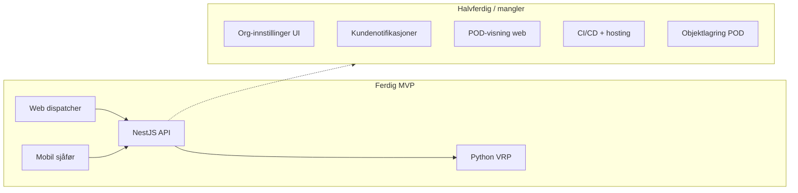
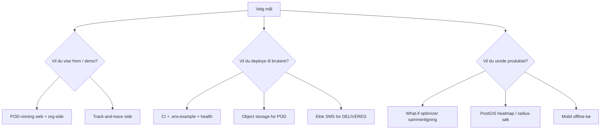

# RoutePilot: hva gjenstår og kreative neste steg

## Kort vurdering

**Ja — det er definitivt mer å gjøre**, men ikke fordi kjernen mangler. Du har bygget et komplett logistikk-MVP:

| Område | Status |
|--------|--------|
| Auth, roller, org-isolasjon | Ferdig |
| CRUD (leveringer, sjåfører, kjøretøy, depot) | Ferdig |
| VRP + reoptimalisering (OR-Tools, 5 mål) | Ferdig |
| Web: kart, dashboard, ruter, CSV-import, rapporter | Ferdig |
| Mobil: rute, stopp, POD (foto + signatur), GPS | Ferdig |
| SSE (`route.updated`, `stop.updated`, `driver.location`) | Delvis (web ja, mobil poller) |
| Kundenotifikasjoner (SMS/e-post) | Kun stub i DB |
| Deploy / CI | Nesten ingenting |
| Tester | Tynt lag (spesielt e2e) |

[README.md](README.md) peker på [TODO.md](./TODO.md), men **den filen finnes ikke** — dokumentasjonen er litt utdatert.

---

## 1. Lavthengende «finish the MVP» (1–3 dager hver)

### Organisasjonsside (allerede API, mangler UI)

- API: `GET/PATCH /organizations/me` i [apps/api/src/organizations/organizations.controller.ts](apps/api/src/organizations/organizations.controller.ts)
- Web: [apps/web/src/App.tsx](apps/web/src/App.tsx) bruker fortsatt [PlaceholderPage](apps/web/src/pages/PlaceholderPage.tsx) på `/settings/org`
- **Gjør:** enkel side med org-navn, slug (read-only), ev. tidssone / standard rute-start

### Leveringsbevis i web (data finnes, UI mangler)

- API inkluderer `proofOfDelivery` på ruter ([apps/api/src/routes/routes.service.ts](apps/api/src/routes/routes.service.ts))
- Typer finnes i [apps/web/src/types/domain.ts](apps/web/src/types/domain.ts), men ingen side viser foto/signatur
- **Gjør:** POD-galleri i arkiv/rutedetalj — viktig for dispatcher ved tvister

### Kundenotifikasjoner (backend stub, ingen web)

- [apps/api/src/notifications/notifications.service.ts](apps/api/src/notifications/notifications.service.ts) markerer alt som `SENT` med `stub: true`
- `NotificationType.ETA` finnes i schema, men **brukes aldri** i kode
- API-liste: `GET /notifications` — ingen web-side
- **Gjør:** integrer Twilio / SendGrid (eller Resend) + enkel «Varslingslogg»-side; koble `DELIVERED`/`FAILED` (allerede enqueued) og legg til ETA ved rute-start

### Dokumentasjon

- Gjenopprett `TODO.md` eller fjern referansen i README
- Legg til `apps/api/.env.example` (README nevner den, filen mangler i repo)

---

## 2. Produksjonsklarhet (viktig hvis dette skal ut av laptop)

| Gap | Hvorfor det betyr noe |
|-----|----------------------|
| **Ingen CI** (0 `.github/workflows`) | Ingen automatisk test ved PR |
| **Kun Redis i Docker** ([docker-compose.yml](docker-compose.yml)) | API/web/optimizer må deployes manuelt |
| **POD som data-URI i Postgres** | Fungerer for demo; ved skala bør foto til Supabase Storage / S3 |
| **E2E-tester** | [apps/api/test/app.e2e-spec.ts](apps/api/test/app.e2e-spec.ts) tester bare `Hello World` — ikke auth/ruter/VRP |
| **API health-check** | Optimizer har `/health`; API mangler tilsvarende for load balancer |
| **PostGIS ubrukt** | `geography(Point)` i schema, men ingen `ST_DWithin` i [apps/api/src](apps/api/src) — geografiske spørringer gjøres i app-laget |

**Anbefalt minimum deploy-sti:**

1. GitHub Actions: `api test` + `web test` + `optimizer pytest` på hver push
2. API på Railway/Fly/Render, web på Vercel/Cloudflare Pages, DB Supabase (allerede antatt)
3. Redis managed (Upstash) for BullMQ
4. OSRM-instans eller public demo med rate limits dokumentert

---

## 3. Kvalitet og sikkerhet (moderat innsats, høy verdi)

- **Utvid e2e:** registrering → levering → optimize job → assign → driver complete → rapport
- **Web-tester:** Reports, Routes, Archive (kun 4 sider har tester i dag)
- **Passord-reset / invitasjon:** finnes ikke (kun admin oppretter sjåfør med passord)
- **JWT refresh** eller kortere TTL + silent refresh — vurder for mobil
- **Mobil sanntid:** [apps/mobile/lib/sse.ts](apps/mobile/lib/sse.ts) er bevisst no-op i RN; vurder polling med backoff eller `@microsoft/fetch-event-source` / WebSocket-gateway
- **Husk meg:** lagrer kun slug+e-post ([apps/web/src/lib/remember-login.ts](apps/web/src/lib/remember-login.ts)) — OK; ikke lagre passord

---

## 4. Kreative produktidéer (differensiering)

Disse bygger på det du allerede har — ingen «start på nytt»:

### A. Kundesporing (lav kode, høy WOW)

Offentlig side `/track/:token` med ETA og status (Levert / På vei). Token knyttet til `deliveryId`, oppdateres via eksisterende notifikasjons-/rute-events.

### B. «What-if» planlegger

Du har 5 `OptimizationObjective` i UI ([OptimizeRoutePanel](apps/web/src/components/OptimizeRoutePanel.tsx)). **Kjør to jobber parallelt** og vis side-ved-side: km, antall ruter, sen leveringer — hjelper dispatchere velge strategi.

### C. Live ETA på kart

Kombiner `estimatedArrival` på stopp + `driver.location` SSE + OSRM for å tegne «ankommer om ~12 min» på [MapPage](apps/web/src/pages/MapPage.tsx) (i dag: posisjon + 30s polling).

### D. Geografisk intelligens (bruk PostGIS)

- «Finn alle PENDING innen 5 km av depot»
- Heatmap av feilede leveringer siste 30 dager
- Foreslå nytt depot basert på leverings-cluster

### E. Dispatcher-assistent (AI, valgfritt)

Naturlig språk: *«Optimaliser alle HIGH prioritet i morgen med 3 biler»* → kaller eksisterende `POST /optimization/jobs`. Ingen ny optimizer — bare et lag over API.

### F. Operasjonell innsikt

- Sammenlign **planlagt vs. faktisk** km/tid per rute (felter finnes: `totalDistanceMeters` vs `actualDistanceMeters`)
- Varsel når sjåfør avviker >X km fra planlagt polyline
- Ukentlig e-postrapport til admin (cron + reports API)

### G. Mobil polish

- Offline-kø for `complete`/`proof` når dekning svikter
- Push-varsler (Expo) når dispatcher tildeler ny rute
- Barcode/QR-scan for pakke-ID ved levering

---

## 5. Anbefalt prioritet (hvis du vil fortsette én retning)

| Prioritet | Oppgave | Estimat | Verdi |
|-----------|---------|---------|-------|
| 1 | POD-visning + org-innstillinger | 1–2 dager | Fullfører synlig MVP |
| 2 | GitHub Actions + `TODO.md` / `.env.example` | 0.5–1 dag | Profesjonelt repo |
| 3 | Ekte kundenotifikasjoner + logg-UI | 2–3 dager | Produktdifferentiator |
| 4 | Deploy-sti dokumentert + health | 1–2 dager | Kan brukes «på ekte» |
| 5 | Kundesporing / what-if / PostGIS | 3–7 dager hver | «Wow»-funksjoner |

---

## Konklusjon

**Prosjektet er ikke «ferdig» i betydningen ferdig produkt** — men **kjerne-MVP er det**. Det som gjenstår er typisk det som skiller en solid student-/sideprosjektkodebase fra noe du kan drifte og selge: deploy, ekte varsler, POD-galleri, tester, og noen differensierende features (sporing, what-if, geo-innsikt).

Anbefaling: start med **POD i web + org-side + CI** (rask gevinst), deretter enten **deploy** eller **kundesporing** avhengig av om målet er portfolio eller pilot hos et reelt firma.
