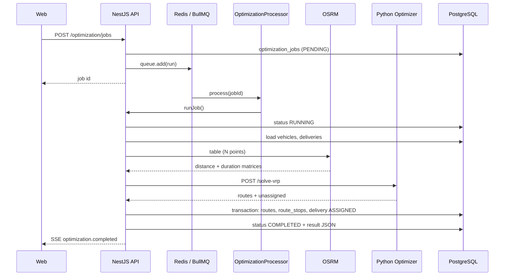

# Optimaliseringspipeline (VRP)

Denne siden beskriver hvordan en optimaliseringsjobb går fra dispatcher-klikk til lagrede ruter i databasen.

## Sekvensdiagram

## Steg for steg

### 1. Opprette jobb (synkront)

**Fil:** `OptimizationService.createJob`  
**Trigger:** `POST /optimization/jobs`

1. Valider `CreateOptimizationJobDto` (kjøretøy, leveringer, dato, mål).
2. Bygg `OptimizationJobRequest` og persister `OptimizationJob` med `status: PENDING`.
3. Legg BullMQ-jobb på køen `optimization` med payload `{ jobId, organizationId }`.
4. Returner jobb til klient (polling via `GET /optimization/jobs/:id` eller SSE).

### 2. Bakgrunnsprosessering

**Fil:** `OptimizationProcessor` → `OptimizationService.runJob`

1. Sett status `RUNNING`, `startedAt`.
2. Kall `executeVrpOptimization`.
3. Ved suksess: `COMPLETED` + `result` JSON + SSE `optimization.completed`.
4. Ved feil: `FAILED` + `errorMessage`.

### 3. Bygge matrisen

**Filer:** `buildMatrixPoints`, `RoutingService`, `OsrmService`

Punkter inkluderer:

- Kjøretøy **start** (og ev. **end** hvis `returnToDepot`)
- Alle valgte **leveringer**

OSRM returnerer:

- `distancesMeters[i][j]`
- `durationsSeconds[i][j]`

### 4. VRP-payload til Python

**Fil:** `OptimizerClientService.solveVrp` → `POST {OPTIMIZER_URL}/solve-vrp`

Mapper leveringer til `VrpDeliveryPayload`:

- `weight_units`, `volume_units` (skalert heltall)
- `time_window_*_sec`, `deadline_sec` relativt til `routeStartTime`
- `priority` + `drop_penalty` per prioritet

Mapper kjøretøy til kapasitetsdimensjoner når `respectCapacity` er true.

Konstanter (API): `SERVICE_TIME_SEC`, `HORIZON_SEC` i `optimization-vrp.util.ts`.

### 5. OR-Tools (Python)

**Filer:** `apps/optimizer/main.py`, `apps/optimizer/vrp.py`

Solver returnerer:

- `routes[]` med `vehicle_index`, `route_indices`, `total_cost`
- `unassigned_delivery_indices` for leveringer som ikke fikk plass

Objectives speiler Prisma-enum `OptimizationObjective`.

### 6. Persistens (transaksjon)

For hver ikke-tom rute fra solver:

1. Opprett `Route` (`PLANNED`, planlagt distanse/tid, `capacityUsedKg`).
2. For hvert besøk: opprett `RouteStop` med `stopOrder` og `estimatedArrival`.
3. Oppdater `Delivery.status` → `ASSIGNED`.
4. Samle **warnings** (f.eks. sene ETA, ikke-tildelte leveringer).

`result` på jobben inneholder bl.a. `routes[]` med `routeId`, `stops[]`, `unassignedDeliveryIds`, `warnings`.

## Re-optimalisering

**Sti:** `POST /routes/:id/reoptimize`  
**Fil:** `RoutesReoptimizeService`

Optimaliserer på nytt for **én eksisterende rute** (typisk gjenværende stopp), uten full multi-vehicle-jobb-UI-flyt. Bruker samme OSRM + optimizer-mønster.

## Avhengigheter

| Komponent | Uten den |
|-----------|----------|
| Redis | Jobb blir ikke prosessert |
| Optimizer (port 8000) | `503` fra API |
| OSRM | Matrise feiler; jobb `FAILED` |
| Gyldige koordinater på leveringer/kjøretøy | Validering/OSRM-feil |

## Miljøvariabler (API)

| Variabel | Standard | Formål |
|----------|----------|--------|
| `OPTIMIZER_URL` | `http://localhost:8000` | Python-tjeneste |
| `OSRM_BASE_URL` | (påkrevd for routing) | OSRM table API |
| `REDIS_HOST` / `REDIS_PORT` | localhost / 6379 | BullMQ |

## Relatert lesning

- [api-contract.md](./api-contract.md) — `POST /optimization/jobs`
- [../domain/terminology.md](../domain/terminology.md) — objectives og statuser
- `apps/api/src/optimization/optimization.service.ts` — full implementasjon
