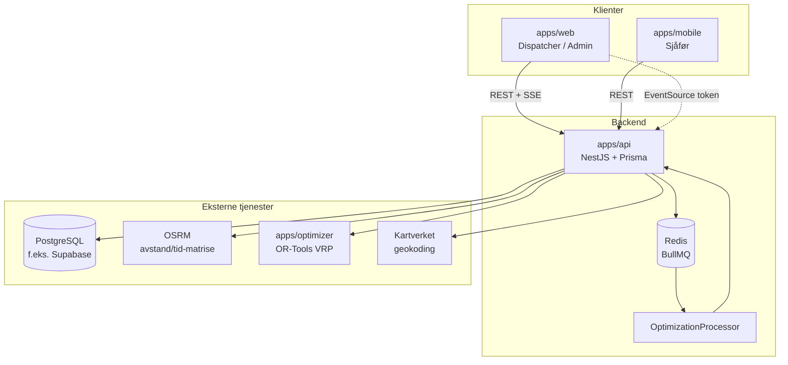

# Arkitekturoversikt

RoutePilot er et monorepo med fire applikasjoner og én støttetjeneste (Redis). All forretningslogikk og persistens går gjennom **API-et**; klientene er tynne.

## Systemdiagram



## Applikasjonsroller

| App | Brukere | Hovedoppgaver |
|-----|---------|---------------|
| **Web** | Admin, dispatcher | CRUD, kart, optimalisere ruter, rapporter, live dashboard |
| **Mobil** | Sjåfør | Dagens rute, fullfør/feil stopp, POD (foto/signatur), GPS-posisjon |
| **API** | Alle | Auth (JWT), validering, org-scope, køjobber, SSE |
| **Optimizer** | Kun API | Ren beregningsmotor: TSP `/solve`, VRP `/solve-vrp` |

Sjåfører har ikke full web-UI; `DRIVER` på web vises som «bruk mobilappen».

## Multi-tenancy og sikkerhet

- Hver **Organization** har egne brukere, leveringer, ruter osv.
- JWT inneholder `sub` (user id), `organizationId`, `role`.
- `OrgScopeService` sikrer at queries alltid er begrenset til brukerens organisasjon.
- Sjåfør-endepunkter (`/routes/me`, `/route-stops/:id/complete`) begrenses ytterligere via `DriverScopeService` der det trengs.

## Dataflyt — planlegging til levering

1. Dispatcher oppretter **leveringer** (`PENDING`) og **kjøretøy/sjåfører**.
2. **Optimaliseringsjobb** opprettes (`POST /optimization/jobs`) → BullMQ → OSRM-matrise → Python VRP → `routes` + `route_stops` i DB.
3. Dispatcher **tildeler** rute til sjåfør (`POST /routes/:id/assign`).
4. Sjåfør **starter** ruten (`POST /routes/:id/start`) — leveringer → `IN_PROGRESS`.
5. Per stopp: **complete** / **fail** + valgfri **POD**.
6. Rute **fullføres**; dashboard og rapporter aggregerer status.

Detaljer for steg 2: [optimization-pipeline.md](./optimization-pipeline.md).

## Sanntid (SSE)

- Endepunkt: `GET /events/stream?token=<JWT>`
- Hendelser: `route.updated`, `stop.updated`, `driver.location`, `optimization.completed`
- Web abonnerer; mobil bruker i dag primært polling (SSE er vanskelig i RN uten ekstra bibliotek).

Implementasjon: `apps/api/src/events/`.

## Integrasjoner

| Tjeneste | Formål | Konfig (API) |
|----------|--------|----------------|
| PostgreSQL | Persistens | `DATABASE_URL` |
| Redis | BullMQ-kø | `REDIS_HOST`, `REDIS_PORT`, … |
| OSRM | Kjøretids-/avstandsmatrise | `OSRM_BASE_URL` |
| Python optimizer | VRP/TSP | `OPTIMIZER_URL` |
| Kartverket | Adresseforslag | Geocoding-modul |

PostGIS-felt (`geography(Point)`) finnes i schema, men geografiske filtre gjøres i dag hovedsakelig i applikasjonslaget — ikke via `ST_DWithin` i SQL.

## Mappestruktur (API)

```
apps/api/src/
├── auth/           JWT, registrering, roller
├── organizations/  Org-profil
├── users/          Brukere (admin)
├── drivers/        Sjåfører + drivers/me/location
├── vehicles/       Kjøretøy
├── depots/         Depot
├── deliveries/     Leveringer + CSV-import
├── optimization/   Jobber, BullMQ, optimizer-klient
├── routing/        OSRM-matrise
├── routes/         Ruter, assign, reoptimize
├── route-stops/    Stopp, POD
├── dashboard/      Sammendrag, live data
├── reports/        Rapporter + CSV/PDF
├── notifications/  Kundenotifikasjoner (stub)
├── events/         SSE
├── geocoding/      Kartverket
└── common/         Org-scope, delte util
```

## Relatert dokumentasjon

- [api-contract.md](./api-contract.md) — endepunkter
- [optimization-pipeline.md](./optimization-pipeline.md) — VRP-detaljer
- [../domain/terminology.md](../domain/terminology.md) — begreper og statuser
