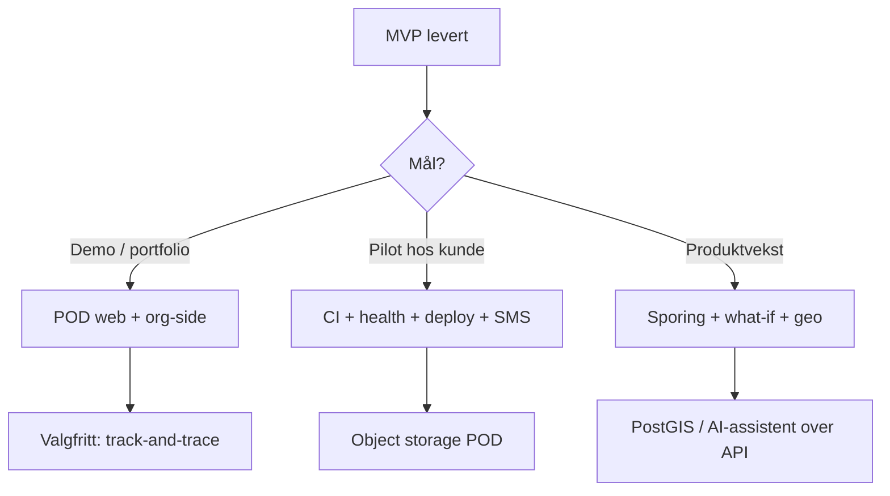

# Roadmap

Prioritert videre arbeid etter MVP. Estimater er grove (én utvikler, heltid ikke antatt).

## Nå — modning (0,5–3 dager per punkt)

| # | Oppgave | Verdi | Notater |
|---|---------|-------|---------|
| 1 | **POD-visning på web** | Fullfører synlig leveringsbevis for dispatcher | `proofOfDelivery` finnes i API; typer i `apps/web/src/types/domain.ts` |
| 2 | **Org-innstillinger UI** | Erstatt `PlaceholderPage` på `/settings/org` | `GET/PATCH /organizations/me` |
| 3 | **CI-pipeline** | Kvalitet ved PR | `api test`, `web test`, `optimizer pytest` |
| 4 | **Dokumentasjon og env** | Onboarding | `apps/api/.env.example`; synk README/TODO |
| 5 | **API health** | Deploy/load balancer | Paritet med optimizer `/health` |

## Kort sikt — produksjon (1–2 uker)

| # | Oppgave | Verdi |
|---|---------|-------|
| 6 | **Deploy-sti dokumentert** | API (Railway/Fly/Render), web (Vercel), DB Supabase, Redis Upstash |
| 7 | **Object storage for POD** | Skalerbar lagring; ikke store data-URI i Postgres |
| 8 | **Ekte kundenotifikasjoner** | Twilio/SendGrid/Resend; `DELIVERED`/`FAILED`; ETA ved rute-start |
| 9 | **Varslingslogg UI** | `GET /notifications` i web |
| 10 | **Utvid e2e** | Registrering → levering → optimize → assign → complete → rapport |

## Middels sikt — kvalitet og sikkerhet

- Passord-reset eller invitasjonslenke for nye sjåfører
- JWT refresh eller kortere TTL + silent refresh (mobil)
- Mobil: polling med backoff eller SSE-bibliotek
- Flere web-tester (Reports, Routes, Archive)
- Rate limits og dokumentasjon for offentlig OSRM

## Produkt — differensiering (3–7 dager hver)

| Idé | Beskrivelse | Bygger på |
|-----|-------------|-----------|
| **Kundesporing** | Offentlig `/track/:token` med ETA/status | Eksisterende rute/levering-events |
| **What-if planlegger** | To optimization-jobs side-ved-side | 5 objectives i UI |
| **Live ETA på kart** | `estimatedArrival` + driver SSE + OSRM | MapPage |
| **PostGIS-innsikt** | Radius-søk, heatmap feilede leveringer | `geography(Point)` i schema |
| **Planlagt vs. faktisk** | Rapport/varsler på avvik | `actualDistanceMeters` / `actualDurationSeconds` |
| **Mobil offline-kø** | Complete/POD når nett svikter | Eksisterende stopp-API |
| **Push (Expo)** | Ny rute tildelt | Assign-endepunkt |

## Anbefalt rekkefølge

1. **Synlig MVP:** POD web + org-innstillinger  
2. **Profesjonelt repo:** CI + `.env.example` + health  
3. **Pilot:** deploy + ekte varsler + POD-lagring  
4. **Wow:** kundesporing eller what-if (velg ett)

## Ikke på roadmap (ennå)

- Multi-org billing / abonnement
- Franchise-lag med delt depot på tvers av org
- Egne ruteoptimaliseringsmotorer utenom OR-Tools

Oppdater denne filen når oppgaver fullføres eller prioriteringer endres.
